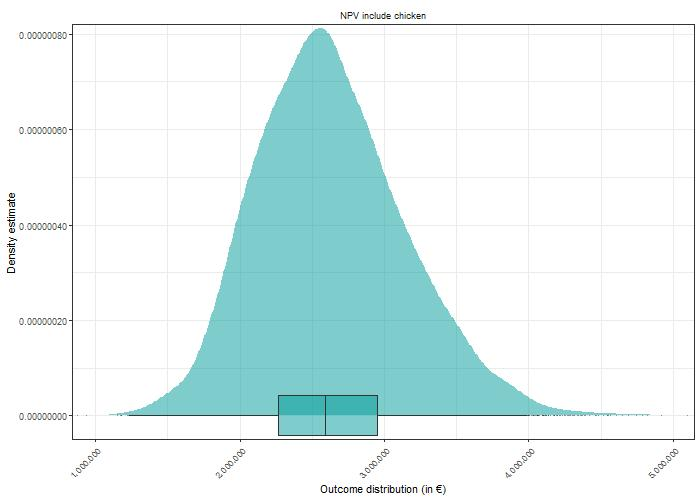
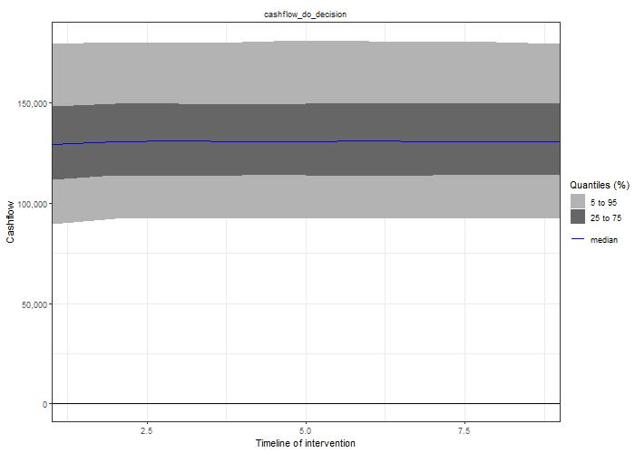

# The bug

*We made two mistakes leading to the weird model outcome which we tried to document and explain in the following parts. For once, in the input table the reduction variables for apple scab, insects etc. was provided as percentages, so 10% was supplied as a 10 in the input table. In code however, we treated the variable as a number betwen 0 and 1. Furthermore, we accidentally added cost and benefits of the chicken-apple system instead subtracting, them, a really painfull mistake. We corrected it in time, but parts of the discussion dedicated to the synergies between chicken and apple are now obsolete. However, we did not want to through the efforts completely away and maybe the thoughts might be helpful at a later stage of a possible chicken-apple project*


# Model Outcome 

The model was run using a Monte-Carlo simulation with 10,000 repetitions. For each iteration, a set of input variables was drawn out of the ranges in the input table. Using the drawn variable values the NVP of the pure apple system (`NPV_apple_only`) and the apple-chicken system (`NPV_apple_chicken`) were calculated (Figure 2). While the overlap of the two resulting distributions is large, it can be seen that the peak of the `NPV_apple_chicken` distribution is further to the right, indicating that on average the combined system is more profitable than the single apple system. 

<!-- only apple vs apple +  chicken plot here here -->

```{r,echo = FALSE,fig.align='center', fig.cap="Figure 2: Outcome of the Monte-Carlo Simulation (n = 10,000) showing in Net Present Value of pure apple system (NPV_apple_only) and apple-chicken combined system (NPV_apple_chicken)"}


```

However, this does not mean that in each case the farmer is better off when including chicken to the apple orchard. Therefore it is necessary to subtract the two NPV distributions to get the change in NPV if the decision (to include chicken) is done (NPV decision) (Figure 3). As can be seen, the NVP of the decision is a) exclusively positive and b) extremely large with a median at more than 2,500,000 €. 


```{r,echo = FALSE,fig.align='center',fig.cap="Figure 3: Outcome of Monte-Carlo-Simulation (n = 10,000) showing the decision to include chicken to apple system (NPV_apple_chicken - NPV_apple_only)"}


```


In the following we wanted to know why the NPV oif the decision is exclusively positive. We therefore devided the NPV of the decision into two parts: 1) the NPV coming directly from the chicken subsystem (`chicken_direct_revenue`) and 2) the indirect benefits due to reduced weed, spray and vole control costs (`chicken_indirect_revenue`). In 1)  the direct costs were subtracted from the benefits, yielding in a distribution which peak is slightly above 0€. Around 59% of the `chicken_direct_benefit` distribution was above 0€, meaning that in more than a third of the cases the costs to keep chicken exceed the revenues of selling produced egg and meat.\
The `chicken_indirect_revenue` of keeping chicken was larger than then direct benefits, as the peak of the distribution is at around 2,500,000€. Since no trade-offs were included in the present model, the distribution of synergies was strictly positive. 


<!-- you can see that I tried to recreate the look of the density plots here, -->

```{r,echo = FALSE,fig.align='center', fig.cap="Figure 4: Outcome of Monte-Carlo-Simulation (n = 10,000) showing the direct revenue (direct benefit - direct cost) and indirect benefit (synergies - trade-off)"}


```
 
The cashflow of the decision shows mostly positive values with 5% quantile at around 90,000€ and 95% quantile at around 175,000€ (Figure 5). Going from the beginning of the period to the first years a minor lift in the casflow can be seen, witht the years following showing a plateau of the cashflow.


next comes a plot on the cashflow. we see that after the initial investment the cashflow stabilizes but variability of income is still large in the following years

```{r,echo = FALSE,fig.align='center', fig.cap="Figure 5: Cashflow of the decision to include chicken into an existing apple orchard"}


```

In the next step, the variables contribution to the NPV decision was calculated using the Partial Least Square (PLS) method. Variables with positive contribution are shown in green/blue and with negative contribution in red. Variables with a Variable Importance in Projection value greater than one include: `reduce_grass`, `egg_price`, `reduce_pest`, `yearly_harvesting_hours`, `diesel_price`, `hourly_wage` and `yearly_mowing_hours`. Of these variables, especially `reduce_grass` and `egg_price` have high scores with values 100% - 50% larger than all the other ones with a score larger than one.


```{r,echo = FALSE,fig.align='center'}


```

Since the NPV curve of the decision is strictly positive, the analysis on the EVPI was unsuccessful. The EVPI is a useful instrument to determine which variables to further research to reduce the uncertainty of the outcome and secure a larger share of positive outcomes of the decisions NPV. 

# Discusion

When consulting the net present value of including chicken to a commercial apple orchard (Figure 3) it appears that it is a safe choice to include the fowls. But the strict positiveness of the distribution as well as the apparent large NPV raise doubts on the validity of the outcome. If including chicken to apple orchard would be that beneficial, then it should be more common. In the following we want to explore why the model yielded such outcome and what could be done to improve the model outcome. At first we need to identify which part of the model contributed to the large positive outcome. We assume that the optimistic model outcome is mainly caused by 1) too optimistic synergies and their implementation, 2) lack of trade-offs 3) inefficiencies in the estimation of field operations and their associated costs.\
At first we will establish why to focus on the indirect revenues or synergies of the model rather than the direct costs and benefits of the chicken subsystem. As can be seen, we will focus mainly on the synergies and trade-offs of the apple-chicken model and neglect most of the direct benefits arising from the chicken system. A reason for this can be seen, when referring to Figure 4. One can see that the indirect benefits of including chicken are much larger than the direct ones. This observation could be interpreted as a pure arithmetical result of the accounting choices we made. While the direct benefits of keeping chicken (selling egg and meat) are balanced by direct costs (fodder, labor, bedding, housing), the indirect benefits (reduced weed, apple scab, insects, voles) have no such counter part in the coded model so far. However, even if no trade-offs are present so far, the ranges of the NPV of the indirect revenues alone are already suspicious. Furthermore, the focus on the indirect revenues justifies when checking the results of the PLS analysis in Figure 5. There, 6 out of 9 variables with a score greater than 1 only influence the synergies (reduce_grass, reduce_pest, reduce_apple_scab, reduce_weed, diesel_price, yearly_mowing_hours). Only one of the nine variables accounts for direct revenues (egg_price). Another variable (hourly_wage) is shared by the two. And the last variable (yearly_harvesting_hours) should actually not be there in the first place but we will talk about that in later section and focus for now on the indirect revenues. It can be clearly seen, that the variables affecting the indirect revenues strongly affect the total model outcome. So inefficiencies with that part of the model are also most likely to explain the distorted model outcome.

The modeled synergies may suffer from their implementation in the coded model. As we established in the introduction, there is evidence that chicken in fruit orchard contribute to a reduction in fungal diseases or harmful insects. We neglect for now the effect on voles as it appears to not influence model outcome only in a minor way, as the PLS outcome suggests. When writing the code, we were unsure how to implement the observation of reduced pest and disease presence in the code. Impacts of chicken presence on yields were not clearly established [@pedersen2004combined], furthermore we assumed that the commercial apple orchard is already managed in a professional with a focus on maximal yield. So we decided against modifying the yield but focused on the costs of disease management instead. We made the optimistic assumption that reduced incidences of the insect / disease linearly translate into also reduced costs of controlling these. This assumption can be challenged, as even if for example chicken reduce apple scab by 20%, this still means that 80% of the apple scab is still present in the orchard and needs to be managed nonetheless. In best case, the application of plant protectants may be delayed and maybe a bit less of the chemicals are applied. But the main driver of costs is the sprayer operation and not the substance applied. It would be important to hear practitioners opinion on that topic and seek out for their input on how to better implement the disease reduction effect in the model. A further problem is that even if the chicken reduce the incidence of pests and diseases in the orchard, they are unlikely to do it homogeneously. As @timmermans2016quality demonstrates there is a gradual decrease of the chickens impact on grass with increasing distance to the coop. So far we assumed a homogeneous effect throughout the orchard. And even if the chicken would affect the orchard in their range of action homogeneously, there is a significant part of the orchard not visited by the chicken at all.Assuming the chicken operate in 100 m radius circle and affect within the circle everything evenly, the affected area would be roughly a 7.8 ha circle. If that circle is placed in the middle of our orchard of 10 ha, which we assume for now is not separated and a perfect square, at least 20% of the orchard is not affected by the chicken at all in the best case. To sum up our first and main concern is about the implementation of the synergies. The translation of reduced incidences of pest and disease to reduced control costs and be challenged and the chicken influence on the orchard gradually decreases with the the distance to the coop.

Another factor contributing to the observed model outcome is the lack of trade-offs in our model. Possible trade-offs include more management costs for field operations (especially spraying) and the chicken harming the trees resulting in either a higher tree-mortality or reduced the yields. By not including those aspects we essentially set the variables value to a certain zero. In the lights of the model outcome it became obvious that the synergies are not balanced but when writing the code we had reasons to not include them. Reagrding the spraying we read reports stating that there were no additional management costs [@alpers2015bericht]. The farmer stated that if sprayed in the evening whent he chicken are within the coop, no furhter costs arise for taking care of the chicken. And concerning the damage on trees, the point was mostly raised for situation in which a chickn farmer decides to introduce young apple trees to the chicken range [@timmermans2016quality], so the opposite to our situation. Younger trees might be more vulnerable because especially the fine roots are susceptable to damage. But since we assumed a case of an aleady established orchard, we felt like the case of tree damage can be neglected. However in the light of the current model outcome, we should consider including these trade-offs to balance the synergistic effects.

Another aspect to be investigated are the core assumptions on the field operations, their frequencies and costs trhoughout the year. We raised this point when noticing that the reduce_grass variable is by far the most important variable according the PLS in Figure 5. When comparing our assumption with a scheme of typical field operations obtained using a spreadsheet tool [@KTBL_tool] we noticed that the role of mowing was largely overestimated. A regular apple orchard year contains 13 cases of fungicide application, 5 cases of insecticide application, 4 combined applications of insecticide and fungicide, and two herbicide application events. In contrast to that, only one mowing event was noted. That shows, that even if the implementation of synergies was correct and they would be balanced by trade-offs, just the ordering within the variables seems odd. So it looks like the hours per year and the associated costs of mowing were overestimated in the input table. Engaging with practitioners and using the KTBL tool should improve our input table and thus the model outcome.

Aside from the apparent overestimation of synergies, we noticed further problems in our model. The listing of yearly_harvest_hours should not have a value larger than one in the PLS analysis. This indicates, that there was a mistake when subtracting the pure apple outcome from the apple+chicken outcome of the model.
