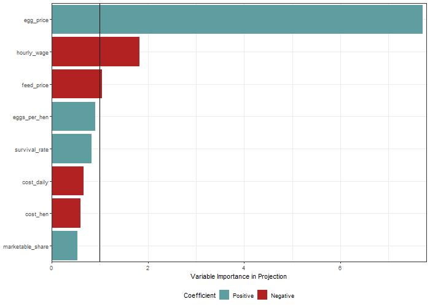

<style>
body {
text-align: justify}
</style>

```{r setup, include=FALSE}
knitr::opts_chunk$set(echo = TRUE)
```


# Introduction
Chicken in apple plantation is an agroforestry practice. The integration of poultry with crops and/or trees production has been identified as a sustainable way to increase the productivity of land and to provide a number of ecosystem services and environmental benefits compared to disaggregated agricultural and woodland systems [@smith2013reconciling]. Literature shows that the outdoor range is in general better used when they had more trees or hedges and the number of birds ranging outside is correlated with the percentage tree cover on the range [@hemery2005novel].
The main benefits to chickens arising from the use of trees are potential changes to the microclimate and animal welfare [@berg2002health]. Chickens kept outside exhibit signs of reduced stress, as evidenced by less pecking damage [@bestman2020predation]. Trees can provide a welfare benefit depending on the sizes and numbers of trees and poultry [@yates2007economic].  They offer an environment closer to that of the jungle fowl from which chicken breeds are descended and the opportunity to express natural behavior [@berg2002health]. In particular, trees provide shade from the sun, dry areas for dust bathing, shelter from aerial predators and from ground predators approaching from the side [@bestman2003farm].  In existing ‘free-range’ egg or meat systems poultry are reluctant to range and only 14% of birds range at one time [@dawkins2003makes].\
The trees can also provide a means of escaping from aggressive behaviour as well as the reduction of visual stimuli that provoke aggression. An increase in the environmental diversity or behavioral enrichment can also increase welfare standards for animals as it permits the expression of frustrated behavioral motivations [@broom1988scientific]. Organic and free-range poultry have, besides having access to a hen house, access to an outdoor run. In this respect, it is well known that poultry are more inclined to use the range when it is enriched with trees, and that in turn feather picking is reduced when more hens use the range [@bestman2003farm]. Thus the establishment of trees in the outdoor run is considered to improve hen welfare.\
Another associated benefit of the system is the provision of valuable revenue streams from commercial tress (apples) and the sales of chicken products (eggs) [@yates2007economic]. Markets for products that have been produced in systems that offer welfare and or environmental benefits and that are perceived as more ‘natural’, have grown substantially in recent years in many countries, particularly in Western Europe. In the UK, freerange eggs (i.e. produced in a system where birds have access to pasture) account for 27% of all eggs produced (DEFRA 2005a) and are retailed at a premium of 22% and 147% compared to conventional ‘barn’ and ‘caged’ produced eggs respectively (British Egg Information Service pers. comm. 2002) [@yates2007economic].\
@brownlow2000alternatives give the following specific reasons for considering such systems:
i). The significant growth in outdoor poultry enterprises (such as free-range egg production) leading to increased demands on land resources.  ii). Recognition of the use of tree cover to improve the welfare conditions of outdoor poultry. iii).The potential for exploiting markets for ‘forest-reared’ poultry. iv). Increasing demands on forest managers to find new uses for forest resources and alternative methods for the silvicultural treatment of tree crops.
Additional benefits of the system is that, where there is more tree cover, fewer water birds will enter. This is critical as water birds can transmit avian influenza virus [@bestman2018presence]. 

The paragraphs above established, that it is quite beneficial for the chicken to be kept in orchards. However, it is unclear if the orchard benefit in a similar way from the presence of the fowl. It is hypothesized that chicken could reduce the presence of harmful insects like the apple sawfly (*Holocampa testudinea*) or the pear midge (*Contarinia pyrivora*) [@pedersen2004combined]. Furthermore, also the incidence of fungal diseases like apple scab caused by the fungus (*Venturia inaequalis*) is suspected to be lower in apple-chicken systems because the chicken feed on the fallen apples leaves which are an important off-season host for the fungus [@timmermans2016quality]. Further benefits could lie in reduced weed control and grass mowing costs because the chicken feed on the weeds and the grass while roaming the orchard. Additionally, the presence of voles might be reduced in a chicken-apple due to the foraging behavior of the chicken.\
While all these aspects hold potential for additional benefit for an apple farmer introducing chicken to the system, the quantification of these apple-chicken synergies is challenging and subject to large uncertainty. Studies dedicated to the chicken-apple synergies [@pedersen2004combined; @timmermans2016quality] are limited and suffer for methodological shortcomings like having investigated only few years or farms for comparison. Also, translating a mere presence of chicken on e.g. the presence of apple sawfly does not necessarily translate in an effect of higher yields [@pedersen2004combined] or reduced control costs. Another aspect to consider is the gradual decrease of the chicken impact on the orchard with increasing distance to the chicken coop [@timmermans2016quality]. Weed control is very effective when the chicken are close to the plantation (48m). However, this is reduce when the coop is far away (198m) from the plantation [@timmermans2016quality].\
Aside from synergistic effects of combining apple and chicken systems, there are also negative consequences possible (trade-offs). For instance trees, especially when they are young, are suspected to be dameged by the chicken when close to the coop due to intensive foraging which might damage the rootstock [@timmermans2016quality]. If not drained properly, also the soil around the coop can become too most making drainage necessary [@bestman2017lessons]. Fruthermore, the presence of chicken could put a further burden on the apple orchard management, because the fencing might be blocking the path and spraying while the chicken are present in the orchard is not allowed. 

As can be seen, deciding whether to include chicken to an already existing apple orchard is less trivial than one might expect. The benefits and cost of the decision are beyond the immediate revenues and cost associate to the additional chicken, due to possible synergies and trade-offs. Furthermore, the economic assessments available to practitioners rely on single values completely ignoring the uncertainty in their estimations (for exanple in @alpers2015bericht p. 16). A framework to overcome such limitations is the Decision Analysis [@luedeling2016decision]. This method is lately used to support the decision with the agricultural sector, like changing an arable maize system to agroforestry in Nothern Vietnam [@do2020decision], the investment in hail nets for cherry trees in Central Chile  [@rojas2021adapting] or even to analyse the impact of agricultural policies on household nutrition in Uganda [@whitney2018probabilistic]. The Decision Analysis framework offers many advantages. Its probabilistic modeling considers the uncertainty of variables value. Furthermore, it allows to make use of expert knowledge instead of relying solely on the outcomes of expensive and methodologically challenged (field) experiments. Thanks to the `decisioSupport` package [@decisionSupport] in R, making use of the aforementioned methodological framework is feasible and will be thus be used in this project.

# Decision
Should a commercial conventional apple farmer, located in North Rhine-Westphalia, Germany, include free-ranging egg-laying chicken to his orchard?


## Decision Maker
Farmers with already established, conventional commercial apple farmer in North Rhine-Westphalia, Germany. Farmers are key decision makers because of the Net Present Value (NPV) calculation in the model. This is a variable which is more important to the producers (farmer).

## Interview with Farmers
Pursuant to our project, we reached out to conventional apple and chicken farmers on our decision to include poultry in apple orchards. We explained to them a particular advantage of our decision model as it allows expert knowledge to be included in the calculations and uncertainties (such as pest suppression) to be explicitly based on expert assessments instead of lengthy measurements. 

Court Farms Chickens in United Kingdom (UK), a farm currently keeping all their birds in apple, cherry and plum orchards rather than in fields. In an interview with the Farm Manager, he mentioned some of the few reasons they are actively practicing the system. According him, the land is cheaper, the trees provide natural cover and shelter which enables the birds display much more natural behavior and are happier. The roots in the ground provide stability and drainage in the winter and which helps prevent the land turning into a mud bath is an environmental benefit that the system provides, he said.\
On the other hand, he expressed his displeasure in the system, he mentioned that, it difficult to install fencing because of the trees and roots. Again trunks of trees needs to be protected from hens. He iterated that fallen fruit is fine to be eaten by the birds but they have to monitor the amount as too much will make them ill so it has to be manually collected each morning and also becomes difficult to harvest the trees with the birds, coops and fencing now in the way.
He further mentioned that, plum stones when eaten by turkeys and chicken can induce cyanide poisoning. 

The Human Resource (HR) and Recruitment Director of AC Gotham and Son farms in the UK pointed out that, chicken in apple orchards is a system that they are unfortunately, not willing to consider. According to him, there are the practical implications of protecting the chickens from natural predators such as foxes, however, the consideration of what they would do with all the eggs laid across the 3000 acres of orchards they have.


## Input Table

An important step of the Decision Analysis is the creation of the input table. It can be fed with the help of calibrated experts but also using other sources like (scientific) reports or own estimations. Variable values are supplied as lower and upper ranges covering the 90% confidence interval of the distribution of the variable. Therefore, the lower estimate marks the 5%-quantile and the 95% quantile bound. Aside from practitioners already engaged in an apple-chicken (or any other kind of fowl combined with a temperate fruit tree), also estimates of other experts like scientists are helpful when constructing the input table. However, in our case we were not able to utilize this source of information effectively. The outreach to experts was rather unstructured and responses came rather late. So instead we focused mainly on reports and own estimations to construct the input table. We heavily relied on a business example of free-range chicken which can be found in @alpers2015bericht (p. 16). Since the variable values were reported not in ranges, we estimated the upper and lower range. The mentioned example covered most of the direct cost and benefits variables related to chicken. \
Variables relating to the apple system and more importantly to the synergies of the apple and chicken system were mostly estimated by ourselves. A reason for this is because information in report about the synergies were a) scarce and b) because the synergies were implemented quite late in the project phase. (add sources in the input table) \
We assumed some variables to be fixed, mainly the ha of the orchard (10 ha) and the flock size (1200 chicken), so that we can exclude effects of scale in our analysis. 


# Conceptual Model

The conceptual model of the decision to include chicken into the apple orchard consists out of two main parts (Figure 1). The first covers the direct costs and benefits of the to be included chicken. Costs consist out of the investment costs and the running costs. Under investment costs falls mainly the infrastructure necessary to keep the chicken which are a mobile chicken house and fencing. Running costs are the recurring cost items of keeping chicken. These are namely the egg-laying hens bought, fodder and bedding, costs of the veterinarian, energy and water, maintenance cost of the housing, costs associated to market the chicken products (like finding a seller for the chicken produce), costs of the animal insurance and additional labor costs. These cost items were expressed on basis per chicken kept, so that they are scaleable when applying the model to another scenario of orchard or flock size. Furthermore, we included the risk of avian influenza which can either occur in the neighborhood of the establishment or within the chicken flock. Either way, it mainly increases the running costs, as there are certain protocols and procedures to follow in these cases putting extra burden on the management. In the neighborhood case, the farmer has to keep the chicken strictly indoor and test the chicken regularly. In case of avian influenza the whole flock needs to be slaughtered. Since the insurance covers for the loss of the chicken value and the forgone revenue by the chicken products, we assumed that avian influenza does not affect the revenue part of our model. Direct benefits of the chicken include the laid eggs throughout the year and the 'old' chicken at the end of the year sold for meat. These are modified by the prices for the produce, the period length of egg-laying and the egg-output per chicken. Furthermore the share of marketable eggs and the 'survival' rate of the chicken affect the benefits. The total direct revenue of keeping chicken in the orchard are calculated by subtracting the costs from the benefits. 

The other component of the model consists out of the apple orchard. In our project we decided to include all aspects of the apple orchard even if not amended by the presence of chicken. So similar to the chicken part, it consists out of the costs and benefits of growing apple, with the difference that the orchard is already established and thus there are no initial investments. Benefits come mainly from the apple harvested and sold, which are modified by the apple price and yield. Costs were differentiated between items affected by the chicken and chicken-independent ones. Chicken independent running costs included pruning, fertilization and apple harvest. Chicken modified costs include the mowing of the lawn in between the apple rows, the weeding within the bare soil strip of the apple rows as well as costs for control of voles, fungal diseases like apple scab and harmful insects like the apple sawfly. 

The unaltered apple orchard costs serve as a baseline to compare the effect of the chicken keeping intervention. In case of the intervention, it is assumed that the cost to control of voles, insect and apple scab are reduced. This can be seen as a synergistic effect of the combined apple and chicken system. If the avian influenza case happens, the benefits of having the chicken in the orchard are set to zero for this year. In the current state of the model, no trade-off effects are included, so chicken and apple in all cases benefit from each other, which seems in hindsight unrealistic. Potential trade-offs like chicken harming trees in their proximity by scratching and foraging should be included in future work on the model. When we formulated the conceptual model we were also interested on scale of The initial idea of including them was to get a feeling of the income proportion of apple and chicken subsystem. But to answer the question whether to add the chicken to orchard, every non-interacting component of the apple subsystem is reduntant and could be excluded in a more refined version of the model.

```{r figs,echo = FALSE,fig.align='center',fig.cap="Figure 1: Graphical model of the appl-chicken system. Red arrows denote negative influences and green arrows positive influences"}


```

# Coded model

The model is structured similar to the graphical model. At first the cost and then the benefits of the apple subsystem are calculated, followed by the expenses and income of the chicken subsystem. In both subsystems the cost items are expressed per tree / chicken. Especially variables covering prices or work time were varied within the years using `vv()`. In case of apple scab, harmful insect control and voles a chance for an especially bad year was included using `chance_event()` and a variable stating by how many percent the control costs increase in case of the event. Furthermore, in case of the event, a yield reduction of the apple trees is assumed. We assumed that these events happen independent from each other, so it is also possible that in an especially unfortunate year all these events happen at the same time. The yield reduction factor is in these cases 'collected' and then applied to reduce the regular yield. Impact of voles on trees were handle differently than apple scab and insect. We assumed that voles kill individual tree by damaging the rootstock. So in case of voles, we assumed that a certain share of the trees die in event of a 'bad' vole year. Furthermore, we assumed that newly planted trees for the first three years do not yield any apples and for the following three years only a lower amount of apples than fully mature apple trees. Yield of young and mature trees were calculated independent from each other. To keep track of the three tree populations (no yield, reduced yield and full yield) a function was written (`calc_tree_population()`). It takes the vector of the `chance_event()` for voles as an input and returns the quantity of mature and young trees as output. In case of apple scab, insect, voles, weeding and mowing, the presence of chicken in the orchard was assumed to be beneficial. To keep the calculations simple, we assumed that the costs of control were reduced but the yield was left unaltered. After havin calculated the costs, the benefits of the apple subsystem was calculated by multiplying the tree populations with yield per tree and apple price.

In the second step costs and benefits of the chicken subsystem were calculated. Most noteworthy is again a `chance_event()` for the two cases of avian influenza: either in neighborhood or within the flock. Since the function was applied for both events independently, there was a small chance that in one year both yield a positive value. In that case the more severe case outweighs and the malus for management cost is only increased by the factor of the flock scenario. In either case the synergistic effect of chicken and apple on the control cost were set to zero for the influenza years because the chickens were kept indoors / were slaughtered. Additional to the threat of avian influenza, we also had a general threat that the chicken might not survive the year in our model, expressed as `survival_rate`. However, in the case of 'regular' death it is assumed that the chicken die right away at the first day, do not produce any eggs or consume any fodder or dirty any bedding. Furthermore, it is assumed that the farmer buys chicken at a yearly basis, even though the high productive egg-laying period is somewhat shorter.

At the end of the model, revenues of the apple subsystem are subtracted from the combined system to model the additional money earned / lost by the decision to include chicken to the apple orchard.


# Model Outcome 

The model was run using a Monte-Carlo simulation with 10,000 repetitions. For each iteration, a set of input variables was drawn out of the ranges in the input table. Using the drawn variable values the NVP of the pure apple system (`NPV_apple_only`) and the apple-chicken system (`NPV_apple_chicken`) were calculated (Figure 2). While the overlap of the two resulting distributions is large, it can be seen that the peak of the `NPV_apple_chicken` distribution is further to the right, indicating that on average the combined system is more profitable than the single apple system. 

<!-- only apple vs apple +  chicken plot here here -->

```{r,echo = FALSE,fig.align='center', fig.cap="Figure 2: Outcome of the Monte-Carlo Simulation (n = 10,000) showing in Net Present Value of pure apple system (NPV_apple_only) and apple-chicken combined system (NPV_apple_chicken)"}
knitr::include_graphics('pictures/density_apple-chicken.jpg')

```

However, this does not mean that in each case the farmer is better off when including chicken to the apple orchard. Therefore it is necessary to subtract the two NPV distributions to get the change in NPV if the decision (to include chicken) is done (NPV decision) (Figure 3). As can be seen, the NVP of the decision is a) exclusively positive and b) extremely large with a median at more than 2,500,000 €. 


```{r,echo = FALSE,fig.align='center',fig.cap="Figure 3: Outcome of Monte-Carlo-Simulation (n = 10,000) showing the decision to include chicken to apple system (NPV_apple_chicken - NPV_apple_only)"}
knitr::include_graphics('pictures/density_decision_do.jpeg')

```


In the following we wanted to know why the NPV oif the decision is exclusively positive. We therefore devided the NPV of the decision into two parts: 1) the NPV coming directly from the chicken subsystem (`chicken_direct_revenue`) and 2) the indirect benefits due to reduced weed, spray and vole control costs (`chicken_indirect_revenue`). In 1)  the direct costs were subtracted from the benefits, yielding in a distribution which peak is slightly above 0€. Around 59% of the `chicken_direct_benefit` distribution was above 0€, meaning that in more than a third of the cases the costs to keep chicken exceed the revenues of selling produced egg and meat.\
The `chicken_indirect_revenue` of keeping chicken was larger than then direct benefits, as the peak of the distribution is at around 2,500,000€. Since no trade-offs were included in the present model, the distribution of synergies was strictly positive. 


<!-- you can see that I tried to recreate the look of the density plots here, -->

```{r,echo = FALSE,fig.align='center', fig.cap="Figure 4: Outcome of Monte-Carlo-Simulation (n = 10,000) showing the direct revenue (direct benefit - direct cost) and indirect benefit (synergies - trade-off)"}
knitr::include_graphics('pictures/density_synergy.jpeg')

```
 
The cashflow of the decision shows mostly positive values with 5% quantile at around 90,000€ and 95% quantile at around 175,000€ (Figure 5). Going from the beginning of the period to the first years a minor lift in the casflow can be seen, witht the years following showing a plateau of the cashflow.


next comes a plot on the cashflow. we see that after the initial investment the cashflow stabilizes but variability of income is still large in the following years

```{r,echo = FALSE,fig.align='center', fig.cap="Figure 5: Cashflow of the decision to include chicken into an existing apple orchard"}
knitr::include_graphics('pictures/cashflow_decision.jpeg')

```

In the next step, the variables contribution to the NPV decision was calculated using the Partial Least Square (PLS) method. Variables with positive contribution are shown in green/blue and with negative contribution in red. Variables with a Variable Importance in Projection value greater than one include: `reduce_grass`, `egg_price`, `reduce_pest`, `yearly_harvesting_hours`, `diesel_price`, `hourly_wage` and `yearly_mowing_hours`. Of these variables, especially `reduce_grass` and `egg_price` have high scores with values 100% - 50% larger than all the other ones with a score larger than one.


```{r,echo = FALSE,fig.align='center'}


```

Since the NPV curve of the decision is strictly positive, the analysis on the EVPI was unsuccessful. The EVPI is a useful instrument to determine which variables to further research to reduce the uncertainty of the outcome and secure a larger share of positive outcomes of the decisions NPV. 

# Discusion

When consulting the net present value of including chicken to a commercial apple orchard (Figure 3) it appears that it is a safe choice to include the fowls. But the strict positiveness of the distribution as well as the apparent large NPV raise doubts on the validity of the outcome. If including chicken to apple orchard would be that beneficial, then it should be more common. In the following we want to explore why the model yielded such outcome and what could be done to improve the model outcome. At first we need to identify which part of the model contributed to the large positive outcome. We assume that the optimistic model outcome is mainly caused by 1) too optimistic synergies and their implementation, 2) lack of trade-offs 3) inefficiencies in the estimation of field operations and their associated costs.\
At first we will establish why to focus on the indirect revenues or synergies of the model rather than the direct costs and benefits of the chicken subsystem. As can be seen, we will focus mainly on the synergies and trade-offs of the apple-chicken model and neglect most of the direct benefits arising from the chicken system. A reason for this can be seen, when referring to Figure 4. One can see that the indirect benefits of including chicken are much larger than the direct ones. This observation could be interpreted as a pure arithmetical result of the accounting choices we made. While the direct benefits of keeping chicken (selling egg and meat) are balanced by direct costs (fodder, labor, bedding, housing), the indirect benefits (reduced weed, apple scab, insects, voles) have no such counter part in the coded model so far. However, even if no trade-offs are present so far, the ranges of the NPV of the indirect revenues alone are already suspicious. Furthermore, the focus on the indirect revenues justifies when checking the results of the PLS analysis in Figure 5. There, 6 out of 9 variables with a score greater than 1 only influence the synergies (reduce_grass, reduce_pest, reduce_apple_scab, reduce_weed, diesel_price, yearly_mowing_hours). Only one of the nine variables accounts for direct revenues (egg_price). Another variable (hourly_wage) is shared by the two. And the last variable (yearly_harvesting_hours) should actually not be there in the first place but we will talk about that in later section and focus for now on the indirect revenues. It can be clearly seen, that the variables affecting the indirect revenues strongly affect the total model outcome. So inefficiencies with that part of the model are also most likely to explain the distorted model outcome.\
The modeled synergies may suffer from their implementation in the coded model. As we established in the introduction, there is evidence that chicken in fruit orchard contribute to a reduction in fungal diseases or harmful insects. We neglect for now the effect on voles as it appears to not influence model outcome only in a minor way, as the PLS outcome suggests. When writing the code, we were unsure how to implement the observation of reduced pest and disease presence in the code. Impacts of chicken presence on yields were not clearly established [@pedersen2004combined], furthermore we assumed that the commercial apple orchard is already managed in a professional with a focus on maximal yield. So we decided against modifying the yield but focused on the costs of disease management instead. We made the optimistic assumption that reduced incidences of the insect / disease linearly translate into also reduced costs of controlling these. This assumption can be challenged, as even if for example chicken reduce apple scab by 20%, this still means that 80% of the apple scab is still present in the orchard and needs to be managed nonetheless. In best case, the application of plant protectants may be delayed and maybe a bit less of the chemicals are applied. But the main driver of costs is the sprayer operation and not the substance applied. It would be important to hear practitioners opinion on that topic and seek out for their input on how to better implement the disease reduction effect in the model. A further problem is that even if the chicken reduce the incidence of pests and diseases in the orchard, they are unlikely to do it homogeneously. As @timmermans2016quality demonstrates there is a gradual decrease of the chickens impact on grass with increasing distance to the coop. So far we assumed a homogeneous effect throughout the orchard. And even if the chicken would affect the orchard in their range of action homogeneously, there is a significant part of the orchard not visited by the chicken at all.Assuming the chicken operate in 100 m radius circle and affect within the circle everything evenly, the affected area would be roughly a 7.8 ha circle. If that circle is placed in the middle of our orchard of 10 ha, which we assume for now is not separated and a perfect square, at least 20% of the orchard is not affected by the chicken at all in the best case. To sum up our first and main concern is about the implementation of the synergies. The translation of reduced incidences of pest and disease to reduced control costs and be challenged and the chicken influence on the orchard gradually decreases with the the distance to the coop.\
Another factor contributing to the observed model outcome is the lack of trade-offs in our model. Possible trade-offs include more management costs for field operations (especially spraying) and the chicken harming the trees resulting in either a higher tree-mortality or reduced the yields. By not including those aspects we essentially set the variables value to a certain zero. In the lights of the model outcome it became obvious that the synergies are not balanced but when writing the code we had reasons to not include them. Reagrding the spraying we read reports stating that there were no additional management costs [@alpers2015bericht]. The farmer stated that if sprayed in the evening whent he chicken are within the coop, no furhter costs arise for taking care of the chicken. And concerning the damage on trees, the point was mostly raised for situation in which a chickn farmer decides to introduce young apple trees to the chicken range [@timmermans2016quality], so the opposite to our situation. Younger trees might be more vulnerable because especially the fine roots are susceptable to damage. But since we assumed a case of an aleady established orchard, we felt like the case of tree damage can be neglected. However in the light of the current model outcome, we should consider including these trade-offs to balance the synergistic effects.\
Another aspect to be investigated are the core assumptions on the field operations, their frequencies and costs trhoughout the year. We raised this point when noticiing that the reduce_grass variable is by far the most important variable according the PLS in Figure 5. When comparing our assumption with a scheme of typical field operations obtained using a spreadsheet tool [@KTBL_tool] we noticed that the role of mowing was largely overestimated. A regular apple orchard year contains 13 cases of fungicide application, 5 cases of insecticide application, 4 combined applications of insecticide and fungicide, and two herbicide application events. In contrast to that, only one mowing event was noted. That shows, that even if the implementation of synergies was correct and they would be balanced by trade-offs, just the ordering within the variables seems odd. 


Thus the observation in Figure 4 might be not enough to pin the distorted model outcome on the indirect benefits alone. However, there is further evidence that the observation 


Direct revenues of the chicken subsystem were calculated as revenues from selling meat and egg minus the input costs of keeping chicken like the housing, food, bedding and more. The indirect revenues are the synergistic effects (reduced apple scab, weeds, insects) minus the trade-offs, with the small but important detail that no trade-offs were coded into our model so far. So while the direct beneifts are balanced by direct costs, 


That means the indirect benefits of keeping chicken are not accounted for the negative aspects like more effort organizing spraying events when the chicken are in the orchard. 

Observation: model ouctome extremely positive. It appears that this is mainly due to the synergies estimation. Reduce grass was the highest scoring variable in PLS and the synergies distribution was extremely large. So the positive effect of synergies must be overestimated. Reasons: 1) too large reduction factors, 2) reduced incidence does not translate into reduced costs for control, because cost are mostly related to the operation of the machine and only to a lesser extent the amount of chemicals applied 3) the positive effect is not homogeneous on the whole orchard as it is modlelled right now. Gradual decrease with a radius of 100 - 150m (but we have 10ha, so assuming a perfect square field 1000 * 1000 m). So assuming the chicken operate in 100 m radius circle and affect within the circle everything evenly, the affected area would be roughly a 7.8 ha circle. So at least 20% of the orchard is not affected by the chicken. 4) the amount of field operation might be overestimated, because when consulting number of the KTBL tool, mowing grass is less of a concern as spraying (number of opertations and costs). 6) there are no tradeoffs in the current model. to be fair we considered including higher management costs due to fence mowing etc but the report in [@alpers2015bericht] said that this is not an issue and that all the spraying operations were done in the evening when the chicken are inside the coop. However one could have includeded a negative effect on the yield by damaging trees close to the coop. 

Another general problem is that we included variables and calculations which should not impact the outcome. All variable sof the apple subsystem not modified by chichken could and should have been not covered in this project because they **should** cancle each other out when subtracting pure apple from chicken-apple. However, hourly_harvesting_hours is in the PLS results, which should not have happened. To be plainly honest, we dont know why. It is not modified by the chicken and should have canceled each other out. 

What should be done differently: 
1) use numbers for apple management of the KTBL tool because reduce grass as most important variable does not make sense. 2) get more involved with experts to improve the inputs of synergies
3) at least adjust the affected area by chicken by the circle in square method, maybe even include a variable for gradual decrease. 
4) remove variables not modified by chicken (harvest, fertilizer) because it seems that they interfer somehow and they are not needed for this project


# References


