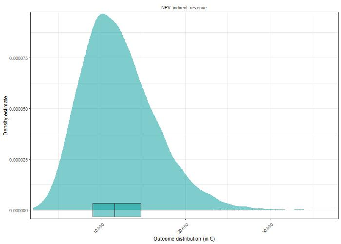

<style>
body {
text-align: justify}
</style>

```{r setup, include=FALSE}
knitr::opts_chunk$set(echo = TRUE)
```


# Introduction
Combining free-ranging chicken with apple plantation is an agroforestry practice. The integration of poultry with crops and/or trees production has been identified as a sustainable way to increase the productivity of land and to provide a number of ecosystem services and environmental benefits compared to disaggregated agricultural and woodland systems [@smith2013reconciling]. Literature shows that the outdoor range is in general better used when they had more trees or hedges and the number of birds ranging outside is correlated with the percentage tree cover on the range [@hemery2005novel].
The main benefits to chickens arising from the use of trees are potential changes to the microclimate and animal welfare [@berg2002health]. Chickens kept outside exhibit signs of reduced stress, as evidenced by less pecking damage [@bestman2020predation]. Trees can provide a welfare benefit depending on the sizes and numbers of trees and poultry [@yates2007economic].  They offer an environment closer to that of the jungle fowl from which chicken breeds are descended and the opportunity to express natural behavior [@berg2002health]. In particular, trees provide shade from the sun, dry areas for dust bathing, shelter from aerial predators and from ground predators approaching from the side [@bestman2003farm].  In existing ‘free-range’ egg or meat systems poultry are reluctant to range and only 14% of birds range at one time [@dawkins2003makes].\
The trees can also provide a means of escaping from aggressive behavior as well as the reduction of visual stimuli that provoke aggression. An increase in the environmental diversity or behavioral enrichment can also increase welfare standards for animals as it permits the expression of frustrated behavioral motivations [@broom1988scientific]. Organic and free-range poultry have, besides having access to a hen house, access to an outdoor run. In this respect, it is well known that poultry are more inclined to use the range when it is enriched with trees, and that in turn feather picking is reduced when more hens use the range [@bestman2003farm]. Thus the establishment of trees in the outdoor run is considered to improve hen welfare.\
Another associated benefit of the system is the provision of valuable revenue streams from commercial tress (apples) and the sales of chicken products (eggs) [@yates2007economic]. Markets for products that have been produced in systems that offer welfare and or environmental benefits and that are perceived as more ‘natural’, have grown substantially in recent years in many countries, particularly in Western Europe. In the UK, freerange eggs (i.e. produced in a system where birds have access to pasture) account for 27% of all eggs produced (DEFRA 2005a) and are retailed at a premium of 22% and 147% compared to conventional ‘barn’ and ‘caged’ produced eggs respectively (British Egg Information Service pers. comm. 2002) [@yates2007economic].\
@brownlow2000alternatives give the following specific reasons for considering such systems:
i). The significant growth in outdoor poultry enterprises (such as free-range egg production) leading to increased demands on land resources.  ii). Recognition of the use of tree cover to improve the welfare conditions of outdoor poultry. iii).The potential for exploiting markets for ‘forest-reared’ poultry. iv). Increasing demands on forest managers to find new uses for forest resources and alternative methods for the silvicultural treatment of tree crops.
Additional benefits of the system is that, where there is more tree cover, fewer water birds will enter. This is critical as water birds can transmit avian influenza virus [@bestman2018presence]. 

The paragraphs above established, that it is quite beneficial for the chicken to be kept in orchards. However, it is unclear if the orchard benefit in a similar way from the presence of the fowl. It is hypothesized that chicken could reduce the presence of harmful insects like the apple sawfly (*Holocampa testudinea*) or the pear midge (*Contarinia pyrivora*) [@pedersen2004combined]. Furthermore, also the incidence of fungal diseases like apple scab caused by the fungus (*Venturia inaequalis*) is suspected to be lower in apple-chicken systems because the chicken feed on the fallen apples leaves which are an important off-season host for the fungus [@timmermans2016quality]. Further benefits could lie in reduced weed control and grass mowing costs because the chicken feed on the weeds and the grass while roaming the orchard. Additionally, the presence of voles might be reduced in a chicken-apple due to the foraging behavior of the chicken.\
While all these aspects hold potential for additional benefit for an apple farmer introducing chicken to the system, the quantification of these apple-chicken synergies is challenging and subject to large uncertainty. Studies dedicated to the chicken-apple synergies [@pedersen2004combined; @timmermans2016quality] are limited and suffer for methodological shortcomings like having investigated only few years or farms for comparison. Also, translating a mere presence of chicken on e.g. the presence of apple sawfly does not necessarily translate in an effect of higher yields [@pedersen2004combined] or reduced control costs. Another aspect to consider is the gradual decrease of the chicken impact on the orchard with increasing distance to the chicken coop [@timmermans2016quality]. Weed control is very effective when the chicken are close to the plantation (48m). However, this is reduce when the coop is far away (198m) from the plantation [@timmermans2016quality].\
Aside from synergistic effects of combining apple and chicken systems, there are also negative consequences possible (trade-offs). For instance trees, especially when they are young, are suspected to be dameged by the chicken when close to the coop due to intensive foraging which might damage the rootstock [@timmermans2016quality]. If not drained properly, also the soil around the coop can become too most making drainage necessary [@bestman2017lessons]. Furthermore, the presence of chicken could put a further burden on the apple orchard management, because the fencing might be blocking the path and spraying while the chicken are present in the orchard is not allowed. 

As can be seen, deciding whether to include chicken to an already existing apple orchard is less trivial than one might expect. The benefits and cost of the decision are beyond the immediate revenues and cost associate to the additional chicken, due to possible synergies and trade-offs. Furthermore, the economic assessments available to practitioners rely on single values completely ignoring the uncertainty in their estimations (for exanple in @alpers2015bericht p. 16). A framework to overcome such limitations is the Decision Analysis [@luedeling2016decision]. This method is lately used to support the decision with the agricultural sector, like changing an arable maize system to agroforestry in Northern Vietnam [@do2020decision], the investment in hail nets for cherry trees in Central Chile  [@rojas2021adapting] or even to analyze the impact of agricultural policies on household nutrition in Uganda [@whitney2018probabilistic]. The Decision Analysis framework offers many advantages. Its probabilistic modeling considers the uncertainty of variables value. Furthermore, it allows to make use of expert knowledge instead of relying solely on the outcomes of expensive and methodologically challenged (field) experiments. Thanks to the `decisioSupport` package [@decisionSupport] in R, making use of the aforementioned methodological framework is feasible and will be thus be used in this project.

# Decision
Should a commercial conventional apple farmer, located in North Rhine-Westphalia, Germany, include free-ranging egg-laying chicken to his orchard?


# Decision Maker
Farmers with already established, conventional commercial apple farmer in North Rhine-Westphalia, Germany. Farmers are key decision makers because of the Net Present Value (NPV) calculation in the model. This is a variable which is more important to the producers (farmer).

# Interview with Farmers
Pursuant to our project, we reached out to conventional apple and chicken farmers on our decision to include poultry in apple orchards. We explained to them a particular advantage of our decision model as it allows expert knowledge to be included in the calculations and uncertainties (such as pest suppression) to be explicitly based on expert assessments instead of lengthy measurements. 

Court Farms Chickens in United Kingdom (UK), a farm currently keeping all their birds in apple, cherry and plum orchards rather than in fields. In an interview with the Farm Manager, he mentioned some of the few reasons they are actively practicing the system. According him, the land is cheaper, the trees provide natural cover and shelter which enables the birds display much more natural behavior and are happier. The roots in the ground provide stability and drainage in the winter and which helps prevent the land turning into a mud bath is an environmental benefit that the system provides, he said.\
On the other hand, he expressed his displeasure in the system, he mentioned that, it difficult to install fencing because of the trees and roots. Again trunks of trees needs to be protected from hens. He iterated that fallen fruit is fine to be eaten by the birds but they have to monitor the amount as too much will make them ill so it has to be manually collected each morning and also becomes difficult to harvest the trees with the birds, coops and fencing now in the way.
He further mentioned that, plum stones when eaten by turkeys and chicken can induce cyanide poisoning. 

The Human Resource (HR) and Recruitment Director of AC Gotham and Son farms in the UK pointed out that, chicken in apple orchards is a system that they are unfortunately, not willing to consider. According to him, there are the practical implications of protecting the chickens from natural predators such as foxes, however, the consideration of what they would do with all the eggs laid across the 3,000 acres of orchards they have.


# Input Table

An important step of the Decision Analysis is the creation of the input table. It can be fed with the help of calibrated experts but also using other sources like (scientific) reports or own estimations. Variable values are supplied as lower and upper ranges covering the 90% confidence interval of the distribution of the variable. Therefore, the lower estimate marks the 5%-quantile and the 95% quantile bound. Aside from practitioners already engaged in an apple-chicken (or any other kind of fowl combined with a temperate fruit tree), also estimates of other experts like scientists are helpful when constructing the input table. However, in our case we were not able to utilize this source of information effectively. The outreach to experts was rather unstructured and responses came rather late. So instead we focused mainly on reports and own estimations to construct the input table. We heavily relied on a business example of free-range chicken which can be found in @alpers2015bericht (p. 16). Since the variable values were reported not in ranges, we estimated the upper and lower range. The mentioned example covered most of the direct cost and benefits variables related to chicken. \
Variables relating to the apple system and more importantly to the synergies of the apple and chicken system were mostly estimated by ourselves. A reason for this is because information in report about the synergies were a) scarce and b) because the synergies were implemented quite late in the project phase. (add sources in the input table) \
We assumed some variables to be fixed, mainly the ha of the orchard (10 ha) and the flock size (1200 chicken), so that we can exclude effects of scale in our analysis. 


# Conceptual Model

The conceptual model of the decision to include chicken into the apple orchard consists out of two main parts (Figure 1). The first covers the direct costs and benefits of the to be included chicken. Costs consist out of the investment costs and the running costs. Under investment costs falls mainly the infrastructure necessary to keep the chicken which are a mobile chicken house and fencing. Running costs are the recurring cost items of keeping chicken. These are namely the egg-laying hens bought, fodder and bedding, costs of the veterinarian, energy and water, maintenance cost of the housing, costs associated to market the chicken products (like finding a seller for the chicken produce), costs of the animal insurance and additional labor costs. These cost items were expressed on basis per chicken kept, so that they are scaleable when applying the model to another scenario of orchard or flock size. Furthermore, we included the risk of avian influenza which can either occur in the neighborhood of the establishment or within the chicken flock. Either way, it mainly increases the running costs, as there are certain protocols and procedures to follow in these cases putting extra burden on the management. In the neighborhood case, the farmer has to keep the chicken strictly indoor and test the chicken regularly. In case of avian influenza the whole flock needs to be slaughtered. Since the insurance covers for the loss of the chicken value and the forgone revenue by the chicken products, we assumed that avian influenza does not affect the revenue part of our model. Direct benefits of the chicken include the laid eggs throughout the year and the 'old' chicken at the end of the year sold for meat. These are modified by the prices for the produce, the period length of egg-laying and the egg-output per chicken. Furthermore the share of marketable eggs and the 'survival' rate of the chicken affect the benefits. The total direct revenue of keeping chicken in the orchard are calculated by subtracting the costs from the benefits. 

The other component of the model consists out of the apple orchard. In our project we decided to include all aspects of the apple orchard even if not amended by the presence of chicken. So similar to the chicken part, it consists out of the costs and benefits of growing apple, with the difference that the orchard is already established and thus there are no initial investments. Benefits come mainly from the apple harvested and sold, which are modified by the apple price and yield. Costs were differentiated between items affected by the chicken and chicken-independent ones. Chicken independent running costs included pruning, fertilization and apple harvest. Chicken modified costs include the mowing of the lawn in between the apple rows, the weeding within the bare soil strip of the apple rows as well as costs for control of voles, fungal diseases like apple scab and harmful insects like the apple sawfly. 

The unaltered apple orchard costs serve as a baseline to compare the effect of the chicken keeping intervention. In case of the intervention, it is assumed that the cost to control of voles, insect and apple scab are reduced. This can be seen as a synergistic effect of the combined apple and chicken system. If the avian influenza case happens, the benefits of having the chicken in the orchard are set to zero for this year. In the current state of the model, no trade-off effects are included, so chicken and apple in all cases benefit from each other, which seems in hindsight unrealistic. Potential trade-offs like chicken harming trees in their proximity by scratching and foraging should be included in future work on the model. When we formulated the conceptual model we were also interested on scale of The initial idea of including them was to get a feeling of the income proportion of apple and chicken subsystem. But to answer the question whether to add the chicken to orchard, every non-interacting component of the apple subsystem is reduntant and could be excluded in a more refined version of the model.

```{r figs,echo = FALSE,fig.align='center',fig.cap="Figure 1: Graphical model of the appl-chicken system. Red arrows denote negative influences and green arrows positive influences"}
knitr::include_graphics('pictures/graphical-model.png')

```

# Coded model

The model is structured similar to the graphical model. At first the cost and then the benefits of the apple subsystem are calculated, followed by the expenses and income of the chicken subsystem. In both subsystems the cost items are expressed per tree / chicken. Especially variables covering prices or work time were varied within the years using `vv()`. In case of apple scab, harmful insect control and voles a chance for an especially bad year was included using `chance_event()` and a variable stating by how many percent the control costs increase in case of the event. Furthermore, in case of the event, a yield reduction of the apple trees is assumed. We assumed that these events happen independent from each other, so it is also possible that in an especially unfortunate year all these events happen at the same time. The yield reduction factor is in these cases 'collected' and then applied to reduce the regular yield. Impact of voles on trees were handle differently than apple scab and insect. We assumed that voles kill individual tree by damaging the rootstock. So in case of voles, we assumed that a certain share of the trees die in event of a 'bad' vole year. Furthermore, we assumed that newly planted trees for the first three years do not yield any apples and for the following three years only a lower amount of apples than fully mature apple trees. Yield of young and mature trees were calculated independent from each other. To keep track of the three tree populations (no yield, reduced yield and full yield) a function was written (`calc_tree_population()`). It takes the vector of the `chance_event()` for voles as an input and returns the quantity of mature and young trees as output. In case of apple scab, insect, voles, weeding and mowing, the presence of chicken in the orchard was assumed to be beneficial. To keep the calculations simple, we assumed that the costs of control were reduced but the yield was left unaltered. After havin calculated the costs, the benefits of the apple subsystem was calculated by multiplying the tree populations with yield per tree and apple price.

In the second step costs and benefits of the chicken subsystem were calculated. Most noteworthy is again a `chance_event()` for the two cases of avian influenza: either in neighborhood or within the flock. Since the function was applied for both events independently, there was a small chance that in one year both yield a positive value. In that case the more severe case outweighs and the malus for management cost is only increased by the factor of the flock scenario. In either case the synergistic effect of chicken and apple on the control cost were set to zero for the influenza years because the chickens were kept indoors / were slaughtered. Additional to the threat of avian influenza, we also had a general threat that the chicken might not survive the year in our model, expressed as `survival_rate`. However, in the case of 'regular' death it is assumed that the chicken die right away at the first day, do not produce any eggs or consume any fodder or dirty any bedding. Furthermore, it is assumed that the farmer buys chicken at a yearly basis, even though the high productive egg-laying period is somewhat shorter.

At the end of the model, revenues of the apple subsystem are subtracted from the combined system to model the additional money earned / lost by the decision to include chicken to the apple orchard.

# Model Outcome

*Disclaimer: 3 days before the deadline a major bug in the code was noticed, which caused some of the model output we were baffled by. Unfortunately we spent already days coming up with explanations why the model Being the diligent students we are, we re-wrote the complete results and discussion on short notice. However, it felt like a crime to trash the before-written parts. If you are ever short on texts where students are desperately trying to make sense out of their weird data, then please look [here](http://htmlpreview.github.io/?https://github.com/larscaspersen/chicken-apple-project/blob/main/old_results.html).*

The model was run using a Monte-Carlo simulation with 10,000 repetitions. For each iteration, a set of input variables was drawn out of the ranges in the input table. Using the drawn variable values the NVP of the pure apple system (`NPV_apple_only`) and the apple-chicken system (`NPV_apple_chicken`) were calculated (Figure 2). As can be seen, the overlap of the two distributions was large and it is difficult to tell which one is more far to the right. Both distributions appear to peak at around 7,500,000€.
\

```{r,echo = FALSE,fig.align='center', fig.cap="Figure 2: Outcome of the Monte-Carlo Simulation (n = 10,000) showing in Net Present Value of pure apple system (NPV_apple_only) and apple-chicken combined system (NPV_apple_chicken)"}
knitr::include_graphics('pictures/density_apple-chicken.jpg')

```

\
To answer the question whether apple farmer should invest in free-range chicken on their orchard, we subtracted the two NPV distributions to get the change in NPV if the decision (to include chicken) is done (NPV decision) (Figure 3). The median of the NPV of the decision is at 66,640€. In 61.35% of the model runs a NPV greater than 0€ was found. The 90% confidence interval of model outcome lies between -324,530€ (5% quantile) and 485,205€ (95% quantile).
\

```{r,echo = FALSE,fig.align='center',fig.cap="Figure 3: Outcome of Monte-Carlo-Simulation (n = 10,000) showing the decision to include chicken to apple system (NPV_apple_chicken - NPV_apple_only)"}
knitr::include_graphics('pictures/old_density_decision_do.jpeg')

```

\
In the following we wanted to investigate how direct and indirect revenues from keeping chicken contributed to the model outcome. Under direct revenues we understand the benefit of selling eggs and meat minus the immediate costs (housing, fodder, labor). The indirect revenues are the synergies (reduced apple scab, harmful insects, voles, grass and weed) minus the trade-offs (not included in the model so far). Because the density estimate varied strongly among direct and indirect revenues we split the figure into two (Figure 4). Median direct chicken revenue (Figure 4a) were 54,812€ with a 90% confidence interval ranging from -336,903€ (5% quantile) to 472,944€ (95% quantile). Roughly 59% of the direct chicken revenue NPV was greater than 0€. The indirect revenue (Figure 4b) had a median of 11,628€ and a 90% confidence interval between 5,954€ (5% quantile) and 20,114€ (95% quantile). As no trade-offs values were subtracted, the NPV of the indirect revenue were strictly positive. The density of the indirect revenues at the distribution peak was roughly five times higher at the peak than the density of the direct chicken revenues.
\


```{r,echo = FALSE,fig.align='center',fig.cap="a ) Direct chicken revenue"}


```
```{r,echo = FALSE,fig.align='center',fig.cap="b ) Indirect chicken revenue"}


```
```{r,echo = FALSE,fig.align='center',fig.cap="Figure 4) Outcome of Monte-Carlo-Simulation (n = 10,000) showing a) the direct revenue (direct benefit - direct cost) and b) indirect benefit (synergies - trade-off)"}


```

\
The cashflow of the decision to include chicken to the orchard shows a slight increase in values going from the first to the following years plateauing there after (Figure 5). Values at the plateau range from approximately -15,000e (5% quantile) to roughly 29,000€ (95% quantile) with a median of about 5,000€.
*Note: actually the investigated time span is 20 years, but even after installing the `decisionSupport` with `devtools::install_github("eikeluedeling/decisionSupport")` the cashflow figure still showed only the first 10 years.* 
\

```{r,echo = FALSE,fig.align='center', fig.cap="Figure 5: Cashflow of the decision to include chicken into an existing apple orchard"}
knitr::include_graphics('pictures/old_cashflow_decision.jpeg')

```

\
In the next step, the variables contribution to the NPV decision was calculated using the Projection to Latent Structures or also called Partial Least Square (PLS) method (Figure 6). Variables with positive contribution are shown in green/blue and with negative contribution in red. Variables with a Variable Importance in Projection (VIP) value greater than one include: egg_price, hourly_wage and feed_price. The VIP score of egg_price is roughly four times higher then of the next highest variable.
\

```{r,echo = FALSE,fig.align='center',fig.cap="Figure 6: Result of the Projection to latent Structures (PLS) analysis on the decision to include chicken to the apple orchard. Bars denote the Variable Importance in the Projection (VIP). Green bars shows variables with positive and red bars variables with negative impact on the NPV"}
knitr::include_graphics('pictures/pls_decision.jpeg')

```

\
The expected value of information (EVPI) was calculated for the decision (Figure 7). For the variable egg_price the EVPI is just shy of 60,000€ and for the variable hourly_wage around 5,000€. For the other variables the EVPI was too low to be shown in the Figure.
\

```{r,echo = FALSE,fig.align='center',fig.cap="Figure 7: Expected value of information (EVPI) of the variables for the decision to include chicken to an apple orchard"}


```


# Discussion

When consulting the net present value of including chicken to a commercial apple orchard (Figure 3) it appears that in most cases including chicken to an already existing apple orchard is beneficial, as in more than 60% of the cases the decision maker is better off when doing so. However, it appears that there is a great deal of insecurity, as the range of possible values for the decisions NPV is large. Judging from the outcomes of PLS (Figure 5) the contribution of the direct revenues of keeping chicken is more important than the indirect ones, as none of the variables relating to the synergies happen to have  a VIP larger than 1, let alone to be displayed in the figure at all. This is also reflected in the distribution of direct and indirect revenues (Figure 4). The most important variable to invest future effort in researching appears to be the egg_price with a EVPI of roughly 60,000€. This means that knowing the (hypothetically) exact price of eggs is worth 60,000€ before making the decision whether or not to include the chicken to the orchard. This underlines the importance of marketing and knowing how to distribute the produce before making the decision to invest. \
So does or projects outcome suggests that investing in chicken is a good strategy for commercial apple growers? That is another story. For once, the model outcome might be too rosy, as no trade-offs between apple and chicken subsystem are implemented. Possible trade-offs include more management costs for field operations (especially spraying) and the chicken harming the trees resulting in either a higher tree-mortality or reduced the yields. By not including those aspects we essentially set the variables value to a certain zero. In the lights of the model outcome it became obvious that the synergies are not balanced but when writing the code we had reasons to not include them. Regarding the spraying we read reports stating that there were no additional management costs [@alpers2015bericht]. The farmer stated that if sprayed in the evening when the chicken are within the coop, no further costs arise for taking care of the chicken. And concerning the damage on trees, the point was mostly raised for situation in which a chicken farmer decides to introduce young apple trees to the chicken range [@timmermans2016quality], so the opposite to our situation. Younger trees might be more vulnerable because especially the fine roots are susceptible to damage. But since we assumed a case of an already established orchard, we decided to ignore it for now. However, if a decision should be made on the basis of the projects outcome, we would suggest to strengthen the efforts to include trade-offs in the model to have a more rounded picture.\
Before noticing a major bug in the code, the PLS outcomes were dominated by variables relating to the synergies between apple and chicken subsystems. In the debugged version, however, none of the variables appear to matter in the PLS or EVPI analysis. But this does not necessarily mean, that the synergies are negligible. For once, the variables were mostly approximated by our group members, because the data coverage is low and the results are ambiguous. Consulting experts on the chosen ranges and even more importantly on the implementation of the synergies (and trade-offs) might be necessary. 
Another improvable aspect of our model is the estimation of working hours and costs of the field operations. We compared our estimations of working hours of mowing and spraying with a standard apple orchard management plan [@KTBL_tool] and noticed that the mowing is overestimated and and the spraying is underestimated. A conventional apple orchard receives through out the year 13 applications of fungicide, five cases of insecticide application, four combined applications of insecticide and fungicide, and two herbicide application events. Mowing usually takes one to two treatments. Both spraying and mowing took a similar amount of time in the standard apple management plan. In our input table we estimated roughly twice the time spent on spraying than on mowing, instead of 1:24 as in the standard management plan [@KTBL_tool]. Furthermore, the share of insect control to fungus control should be not 1:1 as in our input table but rather 15:7. This demonstrates that the assumptions on field operations are improvable. Having improved assumptions with the help of experts or using standard management guides could improve the estimations for control costs. The fungus and insect control costs might have been underestimated in the current model. This might explain the current negligible role of synergies in the current model.\
Another aspect which should be considered when reading this report, is that a farmer usually does not only face a decision of invest not invest but rather a decision between several competing investment options. Even though the farmer might be better off in most cases when introducing free ranging chicken to the orchard, there might be other investment options which are more desirable for the farmer. When comparing the NPV of pure apple and apple combined with chicken the overlap was strong (Figure 2). Assuming the NPV of pure apple is sensible, it appears that even though the farmer might be better off in most cases following the decision (Figure 3), but the investment appears to hardly impact the total NPV. If the NVP is the only decision criterion there might be better investment options closer tied to the main business of a commercial apple farmer like investing in irrigation infrastructure, selective sprayers or other testing other varieties.

# Conclusion

The here carried out Decision Analysis on the question whether a commercial apple farmer should invest in free-raning chicken can be answered with a yes. In roughly 60% of the cases the NPV is positive, so the farmer is better off with the decision compared to doing nothing. Most important variables shaping the decisions NPV are the egg price, the wage of the labor and the chicken feed price. The secondary / indirect benefits of keeping chicken are evident, but are outweighet by the direct revenues. Knowing more about the to be realized egg price before investing is worth up to 60,000€, so more effort should be carried out to determine this variable and re-run the analysis. 


# References


