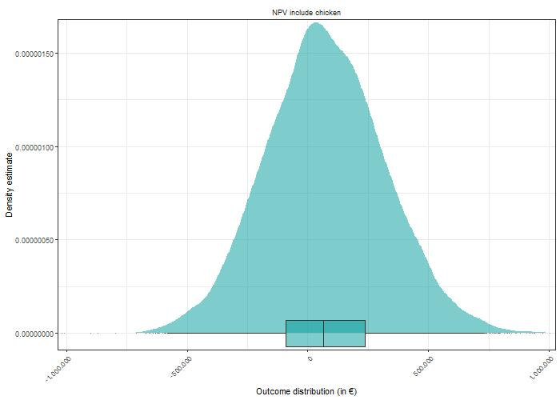

#to justify the text
<style>
body {
text-align: justify}
</style>

```{r setup, include=FALSE}
knitr::opts_chunk$set(echo = TRUE)
```

# Decision
Would German apple farmers include chicken into their apple plantation in order to deal with the programmed banning of certain agro chemicals especially herbicides in the coming years?

# Introduction
Chicken in apple plantation is an agroforestry practice. This system is also known as the Silvopoutry system (integration of poultry with crops and/or trees production) has been identified as a sustainable way to increase the productivity of land and to provide a number of ecosystem services and environmental benefits compared to disaggregated agricultural and woodland systems. Organic and free-range poultry have, besides having access to a hen house, access to an outdoor run. In this respect, it is well known that poultry are more inclined to use the range when it is enriched with trees, and that in turn feather picking is reduced when more hens use the range [@pedersen2004combined].


## Benefits of the System
Chicken welfare (reduced stress, reduce pecking)

Valuable revenue stream (commercial fruit)

More tree cover result fewer water birds coming to the farm and hence lower the rate of transmit avian influenza virus transmission

The trees can provide shade for chicken in summer, and shelter from wind in the winter

The poultry can promote nutrient cycling, reduce scab and pest/weed control

Reduce point load of nutrients because hens spread over a larger surface

## Challenges and uncertatinties of the system
Gradual decrease of chicken benefits with distance to coop

Few studies on disease and pest reduction resulting in (and unclear observations) estimations of inputs

Reducing occurrence of insect, disease and pest does not linearly translate to decrease in controlling these.

Cost/benefit ratio of keeping chicken  

Damage done by chicken on the fruits

# Stakeholders
Our stakeholders are the people who will directly or indirectly benefit form the decision model. They Include;Farmers (apple and chicken), Retailers, Consumers, Non-governmental organizations (NGOs).

## Decision Maker
Farmers with already established, conventional commercial apple farmer in NW Europe. Farmers are key decision makers because of the Net Present Value (NPV) calculation in the model. This is a variable which is more important to the producers (farmer).

## Input table

# Conceptual Model

The conceptual model of the decision to include chicken into the apple orchard consists out of two main parts (refer to picture). The first covers the direct costs and benefits of the to be included chicken. Costs consist out of the investment costs and the running costs. Under investment costs falls mainly the infrastructure necessary to keep the chicken which are a mobile chicken house and fencing. Running costs are the recurring cost items of keeping chicken. These are namely the egg-laying hens bought, fodder and bedding, costs of the veterinarian, energy and water, maintenance cost of the housing, costs associated to market the chicken products (like finding a seller for the chicken produce), costs of the animal insurance and additional labor costs. These cost items were expressed on basis per chicken kept, so that they are scaleable. Furthermore, we included the risk of avian influenza which can either occur in the neighborhood of the establishment or within the chicken flock. Either way, it mainly increases the running costs, as there are certain protocols and procedures to follow in these cases putting extra burden on the management. In the neighborhood case, the farmer has to keep the chicken strictly indoor and test the chicken regularly. In case of avian influenza the whole flock needs to be slaughtered. Since the insurance covers for the loss of the chicken value and the forgone revenue by the chicken products, we assumed that avian influenza does not affect the revenue part of our model. Direct benefits of the chicken include the laid eggs throughout the year and the 'old' chicken at the end of the year sold for meat. These are modified by the prices for the produce, the period length of egg-laying and the egg-output per chicken. Furthermore the share of marketable eggs and the 'survival' rate of the chicken affect the benefits. The total direct revenue of keeping chicken in the orchard are calculated by subtracting the costs from the benefits. 

The other component of the model consists out of the apple orchard. In our project we decided to include all aspects of the apple orchard even if not amended by the presence of chicken. So similar to the chicken part, it consists out of the costs and benefits of growing apple, with the difference that the orchard is already established and thus there are no initial investments. Benefits come mainly from the apple harvested and sold, which are modified by the apple price and yield. Costs were differentiated between items affected by the chicken and chicken-independent ones. Chicken independent running costs included pruning, fertilization and apple harvest. Chicken modified costs include the mowing of the lawn in between the apple rows, the weeding within the bare soil strip of the apple rows as well as costs for control of voles, fungal diseases like apple scab and harmful insects like the apple sawfly. 

The unaltered apple orchard costs serve as a baseline to compare the effect of the chicken keeping intervention. In case of the intervention, it is assumed that the cost to control of voles, insect and apple scab are reduced. This can be seen as a synergistic effect of the combined apple and chicken system. If the avian influenza case happens, the benefits of having the chicken in the orchard are set to zero for this year. In the current state of the model, no trade-off effects are included, so chicken and apple in all cases benefit from each other, which seems in hindsight unrealistic. Potential trade-offs like chicken harming trees in their proximity by scratching and foraging should be included in future work on the model. When we formulated the conceptual model we were also interested on scale of The initial idea of including them was to get a feeling of the income proportion of apple and chicken subsystem. But to answer the question whether to add the chicken to orchard, every non-interacting component of the apple subsystem is reduntant and could be excluded in a more refined version of the model.

```{r,echo = FALSE,fig.align='center'}
knitr::include_graphics('pictures/graphical-model.png')

```

# Coded model

The model is structured similar to the graphical model. At first the cost and then the benefits of the apple subsystem are calculated, followed by the expenses and income of the chicken subsystem. In both subsystems the cost items are expressed per tree / chicken. Especially variables covering prices or work time were varied within the years using `vv()`. In case of apple scab, harmful insect control and voles a chance for an especially bad year was included using `chance_event()` and a variable stating by how many percent the control costs increase in case of the event. Furthermore, in case of the event, a yield reduction of the apple trees is assumed. We assumed that these events happen independent from each other, so it is also possible that in an especially unfortunate year all these events happen at the same time. The yield reduction factor is in these cases 'collected' and then applied to reduce the regular yield. Impact of voles on trees were handle differently than apple scab and insect. We assumed that voles kill individual tree by damaging the rootstock. So in case of voles, we assumed that a certain share of the trees die in event of a 'bad' vole year. Furthermore, we assumed that newly planted trees for the first three years do not yield any apples and for the following three years only a lower amount of apples than fully mature apple trees. Yield of young and mature trees were calculated independent from each other. To keep track of the three tree populations (no yield, reduced yield and full yield) a function was written (`calc_tree_population()`). It takes the vector of the `chance_event()` for voles as an input and returns the quantity of mature and young trees as output. In case of apple scab, insect, voles, weeding and mowing, the presence of chicken in the orchard was assumed to be beneficial. To keep the calculations simple, we assumed that the costs of control were reduced but the yield was left unaltered. After havin calculated the costs, the benefits of the apple subsystem was calculated by multiplying the tree populations with yield per tree and apple price.

In the second step costs and benefits of the chicken subsystem were calculated. Most noteworthy is again a `chance_event()` for the two cases of avian influenza: either in neighborhood or within the flock. Since the function was applied for both events independently, there was a small chance that in one year both yield a positive value. In that case the more severe case outweighs and the malus for management cost is only increased by the factor of the flock scenario. In either case the synergistic effect of chicken and apple on the control cost were set to zero for the influenza years because the chickens were kept indoors / were slaughtered. Additional to the threat of avian influenza, we also had a general threat that the chicken might not survive the year in our model, expressed as `survival_rate`. However, in the case of 'regular' death it is assumed that the chicken die right away at the first day, do not produce any eggs or consume any fodder or dirty any bedding. Furthermore, it is assumed that the farmer buys chicken at a yearly basis, even though the high productive egg-laying period is somewhat shorter.

At the end of the model, revenues of the apple subsystem are subtracted from the combined system to model the additional money earned / lost by the decision to include chicken to the apple orchard.

<!-- ask in wednesday office hour if they want us to implement their feedback (effect of chicken on apple yield) -->

<!-- mention that some variables were assumed to be constant (like the years until full yield for apple, the total number of trees or the size of the chicken flock) -->

# Model Outcome Outcome

first plot to show distributions of apple vs apple + chicken. they are very similar because the absolute impact of chicken is relatively low

<!-- only apple vs apple +  chicken plot here here -->

```{r,echo = FALSE,fig.align='center'}
knitr::include_graphics('pictures/density_apple-chicken.jpg')

```

In the next plot you can see the direct revenue of the chicken subsystem `chicken direct benefit` plotted against the simulated synergies `synergies`. While the direct benefits of keeping the chicken is subject to some risk as roughly a third of the density plot is negative, the synergies are strictly positive. Furthermore, the synergistic effect are much higher than the direct benefits. This raises doubts if the current parameter choices are accurate.

<!-- you can see that I tried to recreate the look of the density plots here, -->

```{r,echo = FALSE,fig.align='center'}
knitr::include_graphics('pictures/density_synergy.jpeg')

```


write about the density plot of inclduding chicken to the apple orchard. extremely positive, probably because we overestimated the positive effect of the chicken on the orhard

```{r,echo = FALSE,fig.align='center'}


```

next comes a plot on the cashflow. we see that after the initial investment the cashflow stabilizes but variability of income is still large in the following years

```{r,echo = FALSE,fig.align='center'}


```

I am still curious how the cashflow looks like if the we investigate the cummulative cashflow. Maybe I can make a plot on that aswell to see how long on average it takes to come even.

```{r,echo = FALSE,fig.align='center'}
knitr::include_graphics('pictures/dummy_picture.jpg')

```

The second part is about the PLS analysis on the decision do part. then we can see some bar charts on that.biggest drives propably are the cost benefits of chicken in the orchard

```{r,echo = FALSE,fig.align='center'}
knitr::include_graphics('pictures/pls_decision.jpeg')

```

finally we will have a plot on the evpi for decision do. since right now everything is mostly positive, there is not much interesting to see

```{r,echo = FALSE,fig.align='center'}
knitr::include_graphics('pictures/dummy_picture.jpg')

```

# Discusion

# References


